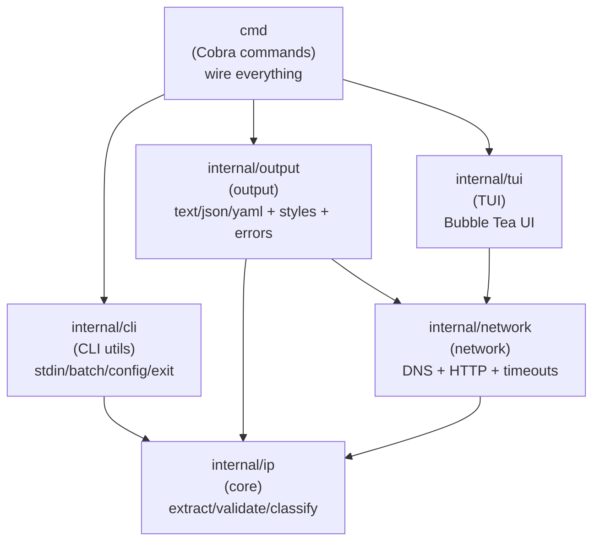

# IPQ - IP Query Tool

A modern CLI/TUI tool for querying IP addresses and domains.

## Features

- Query public IPv4/IPv6 addresses
- Look up any IP or domain
- IP type identification (Public/Private/Loopback)
- Geolocation and ISP information
- Multiple input sources: args, clipboard, stdin, file
- Multiple output formats: TUI, JSON, YAML, text, quiet
- Respects `NO_COLOR` and auto-detects non-interactive environments

## Installation

```bash
# Build (Linux/macOS)
go build -o ipq

# Build (Windows)
go build -o ipq.exe

# Build with version info (optional)
# go build -o ipq -ldflags "-X github/shawn/ip-tool/cmd.Version=v0.1.0 -X github/shawn/ip-tool/cmd.GitCommit=abc123 -X github/shawn/ip-tool/cmd.BuildDate=2026-01-26"
```

## Usage

```bash
ipq [target] [flags]
```

| Flag / Command | Description |
|------|-------------|
| `-c` | Read from clipboard |
| `-d` | Show detailed info |
| `-f FILE` | Read targets from file |
| `--batch` | Batch process from stdin |
| `-o FORMAT` | Output: json, yaml, text, quiet |
| `-q` | Quiet mode (only IPs) |
| `version` | Print version (`--verbose` for details) |

## Examples

```bash
ipq                    # Query your public IP
ipq 8.8.8.8 -d         # Query with details
ipq google.com         # Query domain
ipq -c                 # From clipboard
echo "8.8.8.8" | ipq   # From stdin
ipq -f ips.txt         # Batch from file
ipq 8.8.8.8 -o json    # JSON output
ipq 8.8.8.8 -q         # Quiet output (IPs only)
ipq version --verbose  # Version details
```

### Notes (Windows / PowerShell)

- **Stdin with quotes**: PowerShell may include quotes when piping. `ipq` trims surrounding quotes, so these are both OK:

```powershell
echo "8.8.8.8" | ipq
"8.8.8.8" | ipq
```

- **Batch YAML/JSON**:

```powershell
cat ips.txt | ipq --batch -o yaml
cat ips.txt | ipq --batch -o json
```

## Demo (TUI output example)

```
$ ipq 8.8.8.8 -d

 [DONE]  Target: 8.8.8.8
 ─────────────────────────────────────────
  IPv4      : 8.8.8.8 [Public]
  IPv6      : N/A

  [ GEOLOCATION ]
  ISP       : Google LLC
  Location  : Mountain View, California, US

  [ ATTRIBUTES ]
  Mobile Net   : No
  Proxy/VPN    : No
  Data Center  : ✓ Yes

 (r to refresh, 4/6 to copy, q to quit)
```

## Interactive Keys

| Key | Action |
|-----|--------|
| `r` | Refresh |
| `d` | Toggle detail |
| `4/6` | Copy IPv4/IPv6 |
| `q` | Quit |

## Architecture

Layered architecture with **one-way dependencies** (no cycles):



## Project Structure

```
.
├── cmd/                    # CLI 命令
│   ├── root.go             # 主命令
│   ├── version.go          # 版本命令
│   └── completion.go       # Shell 补全
│
├── internal/
│   ├── ip/                 # IP 地址处理 (底层)
│   │   ├── classify.go     # 类型分类
│   │   └── validate.go     # 验证、URL 提取
│   │
│   ├── network/            # 网络请求
│   │   ├── types.go        # 数据结构
│   │   ├── dns.go          # DNS 解析
│   │   ├── fetch.go        # HTTP 请求
│   │   └── resolve.go      # 统一解析接口
│   │
│   ├── output/             # 输出格式化
│   │   ├── style.go        # 终端样式
│   │   ├── error.go        # 错误格式化
│   │   └── format.go       # JSON/YAML/Text
│   │
│   ├── tui/                # 交互式界面
│   │   └── app.go          # Bubble Tea 应用
│   │
│   └── cli/                # CLI 辅助
│       ├── exit.go         # 退出码
│       ├── config.go       # 配置加载
│       ├── input.go        # stdin/环境检测
│       └── batch.go        # 批量处理
│
├── main.go
├── go.mod
└── README.md
```

## Environment Variables

| Variable | Description |
|----------|-------------|
| `NO_COLOR` | Disable colors |
| `CI` | Force non-interactive mode |


## Shell Completion

```bash
ipq completion bash > /etc/bash_completion.d/ipq
ipq completion zsh > "${fpath[1]}/_ipq"
ipq completion fish > ~/.config/fish/completions/ipq.fish
ipq completion powershell >> $PROFILE
```

## License

MIT
